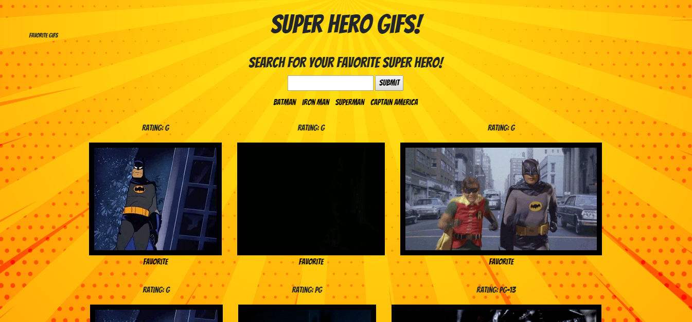

# Giftastic

Search for the gifs you want to see using the GIPHY API.

## Getting Started

You can find the game at this link: 
[Super Hero Gifs](https://liangbryan2.github.io/giftastic/)

### Prerequisites

This site was tested on Google Chrome but should work on any internet browser.

```
Google Chrome
Firefox
Microsoft Edge
etc.
```
### Images



### Code Snippets
JavaScript 

Here we have a code snippet of my JavaScript. This is a funciton that generates gifs when you click on a button. It issues an ajax call to get gifs from the Giphy API and calls another function, makeGif(), that actually makes the gif and manipulates the DOM.
``` js
function generateGifs(button) {
    query = button.attr("data-hero");
    if (previous === button.attr("data-hero")) {
        offset += 10;
        // console.log(offset);
        $.ajax({
            url: baseURL + query + apiKey + limit + "&offset=" + offset,
            method: "GET"
        }).then(function (result) {
            makeGif(result);
        });
    } else {
        offset = 0;
        $("#gifSection").empty();
        $.ajax({
            url: baseURL + query + apiKey + limit,
            method: "GET"
        }).then(function (result) {
            console.log(result);
            makeGif(result);
        });
    }
}
```

CSS

Here we have CSS code that is for the spinning header. I thought it was pretty neat, so I included it here.
``` css
header {
    transform: rotate(-10deg);
    padding: 20px;
    animation: headerRotate 10s infinite;
}
@keyframes headerRotate {
    0%, 80% {
        transform: rotate(0deg);
    }
    100% {
        transform: rotate(3600deg);
    }
}
```
HTML

The HTML is very plain for this project because the goal was to add dynamically generated divs to the DOM as the user searches or presses buttons.


## Built With

* HTML
* JavaScript/jQuery
* CSS/Bootstrap
* GIPHY API

## Learning Points

The main goal of this project was to learn how to use the Giphy API and the jQuery ajax call. The ajax call returns a JSON object, so learning how to read that was also apart of this project. JSON objects are very similar to normal objects so accessing their data was not too hard of a challenge. The Giphy API has nice documentation so learning about the parameters was also very smooth. The hard parts were dynamically generating the gif with the favorite button attachment. I have a solution, as you can see from the site, but I feel like there has to be a better way. I stored the data in both the image and the button so that I can access the data on a button click since an image click already has the purpose of playing the gif. All in all, I am happy the way this project turned out.

## Author

**Bryan Liang** - [My Github](https://github.com/liangbryan2)

## License

This project is licensed under the MIT License - see the [LICENSE.md](LICENSE.md) file for details

## Acknowledgements
Thank you for the API.

[Giphy API](https://developers.giphy.com/)